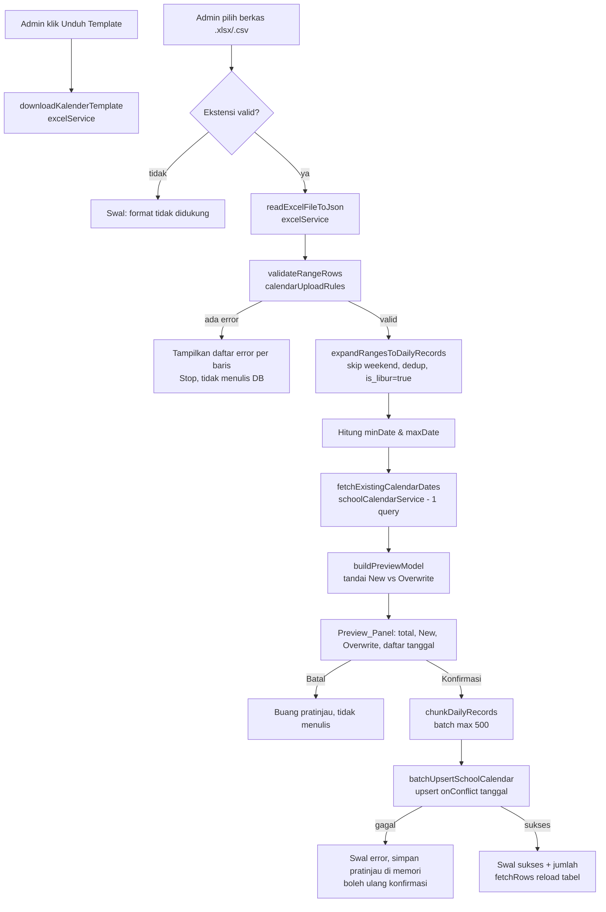

# Design Document

## Overview

Fitur **Kalender Pendidikan Upload** menambahkan alur unggah massal hari libur ke halaman admin Kalender Sekolah (`AdminSchoolCalendarPage.jsx`) pada aplikasi ASIK. Admin mengunduh template Excel berformat rentang, mengisinya dari kalender pendidikan resmi, mengunggahnya, meninjau pratinjau yang membedakan tanggal baru dan tanggal yang menimpa, lalu menyimpan seluruh hari libur secara batch ke tabel `school_calendar` (upsert `onConflict 'tanggal'`).

Desain ini mengikuti arsitektur berlapis aplikasi yang sudah ada:

- **Pages (UI)** → orkestrasi antarmuka + state, memanggil service dan util.
- **Services** → query Supabase + side-effect (baca/tulis DB, unduh file).
- **utils/\*.js (LOGIKA MURNI)** → parsing, validasi, expand, preview, batching yang diuji dengan `node --test` (`*.test.mjs`) tanpa DB.

Prinsip kunci desain:

1. **Semua logika yang bisa diuji tanpa DB dipisahkan** ke `src/features/admin/utils/calendarUploadRules.js` agar dapat diuji secara deterministik.
2. **Skema penulisan identik dengan Manual_Entry** (`tanggal`, `is_libur`, `keterangan`, `updated_at`, `onConflict: 'tanggal'`) sehingga modul absensi lain (apel, mapel, pembiasaan) tidak terpengaruh.
3. **Hanya menandai `is_libur = true`.** Hari aktif tetap implisit; akhir pekan (Sabtu–Minggu) tetap ditangani otomatis oleh `attendanceDayService`/`schoolDayRules` yang sudah ada, sehingga Weekend_Date tidak perlu (dan tidak boleh) ditulis.
4. **Hemat kuota free-tier**: satu query untuk mengambil tanggal existing dalam rentang min–max pratinjau, dan penulisan batch berukuran maksimum 500 baris per permintaan.

Fitur ini bersifat aditif: `Manual_Entry` (form satu tanggal) dan aksi hapus per baris tetap dipertahankan.

## Architecture

### Layering

```
AdminSchoolCalendarPage.jsx  (UI / orkestrasi state)
│
├─ readExcelFileToJson(file)                     → excelService.js        (parsing berkas, existing)
├─ downloadKalenderTemplate()                    → excelService.js        (generator template, baru)
│
├─ parseFlexibleDate / validateRangeRows /       → calendarUploadRules.js (LOGIKA MURNI, baru)
│  expandRangesToDailyRecords / buildPreviewModel/
│  chunkDailyRecords
│
├─ fetchExistingCalendarDates({minDate,maxDate}) → schoolCalendarService.js (query DB, baru)
└─ batchUpsertSchoolCalendar({dailyRecords})     → schoolCalendarService.js (tulis DB batch, baru)
```

Logika murni (`calendarUploadRules.js`) tidak mengimpor Supabase maupun React. Service adalah satu-satunya lapisan yang menyentuh `supabase`. UI hanya mengorkestrasi.

### Alur Data (happy path)



### Batasan & Keputusan Desain

- **Pemisahan expand vs preview.** `expandRangesToDailyRecords` murni deterministik (tidak butuh DB). Status New/Overwrite baru ditentukan di `buildPreviewModel` setelah tanggal existing diambil, karena butuh data DB. Ini menjaga fungsi expand tetap mudah diuji.
- **Query existing tunggal berbasis rentang.** Alih-alih mengecek tiap tanggal, `fetchExistingCalendarDates` mengambil kolom `tanggal` di antara `minDate`–`maxDate` (kolom `tanggal` unik & terindeks), lalu UI/util membentuk `Set` untuk klasifikasi O(1). Ini menekan jumlah panggilan Supabase (free-tier).
- **Weekend tidak ditulis.** `expandRangesToDailyRecords` melewati Weekend_Date memakai logika yang sama dengan `schoolDayRules.isBusinessWeekdayWIBDate` (anchor `T12:00:00+07:00`). Konsistensi memastikan Requirement 9.3 terpenuhi tanpa duplikasi perilaku.
- **Perhitungan tanggal WIB tanpa geser hari.** Semua enumerasi tanggal memakai anchor tengah hari WIB + `Intl` `en-CA` `Asia/Jakarta`, meniru `dateService.formatDateToWIB`, sehingga tidak ada pergeseran satu hari akibat UTC. Jika `Intl`/zona WIB tidak tersedia, fungsi jatuh ke zona sistem dan menandai flag peringatan yang ditampilkan UI (Requirement 5.7).

## Components and Interfaces

### 1. Logika Murni — `src/features/admin/utils/calendarUploadRules.js` (baru)

Konstanta:

```js
export const MAX_RANGE_SPAN = 400;                 // hari per Range_Row (Req 4.5)
export const BATCH_SIZE = 500;                     // baris per batch upsert (Req 7.3)
export const REQUIRED_COLUMNS = ['tanggal_mulai', 'tanggal_selesai'];
```

#### `parseFlexibleDate(rawValue) → { iso, error }`

Menerima `YYYY-MM-DD` dan `DD/MM/YYYY`, mengembalikan ISO_Date (`YYYY-MM-DD`) atau error.

```
parseFlexibleDate(raw):
  s = trim(String(raw))
  if s kosong: return { iso: null, error: null }        // keterangan/nilai kosong ditangani pemanggil
  if s cocok /^\d{4}-\d{2}-\d{2}$/: y,m,d dari s
  else if s cocok /^\d{1,2}\/\d{1,2}\/\d{4}$/: d,m,y dari s
  else: return { iso: null, error: 'format tak dikenal' }
  // rakit & validasi kalender pakai anchor WIB tengah hari
  candidate = `${yyyy}-${mm}-${dd}`
  wibIso = formatIsoWIB(new Date(`${candidate}T12:00:00+07:00`))   // fallback zona sistem bila Intl gagal
  if wibIso !== candidate (tanggal tak nyata, mis. 31/02): return { iso: null, error: 'tanggal tidak valid' }
  return { iso: candidate, error: null }
```

Catatan: penggunaan anchor tengah hari + format `Intl en-CA Asia/Jakarta` memastikan tidak ada pergeseran hari (mirror `dateService`). Menyediakan `formatIsoWIB` internal dengan `try/catch` untuk fallback zona sistem.

#### `enumerateDatesInclusiveWIB(startIso, endIso) → string[]`

Helper murni: menghasilkan array ISO_Date dari start hingga end inklusif, iterasi per hari dengan anchor tengah hari WIB agar aman DST/zona. Dipakai oleh expand.

#### `isWeekendWIBDate(iso) → boolean`

Kebalikan `isBusinessWeekdayWIBDate` (Sabtu/Minggu). Diselaraskan dengan `schoolDayRules`.

#### `validateRangeRows(rawRows) → { rows, errors }`

```
validateRangeRows(rawRows):
  errors = []
  // 1. cek kolom wajib (Req 4.1) — periksa kunci pada baris pertama non-kosong
  missing = REQUIRED_COLUMNS yang tidak ada di header
  if missing tidak kosong:
     errors.push(`Kolom wajib hilang: ${missing.join(', ')}.`)
     return { rows: [], errors }
  rows = []
  for (index, raw) of rawRows:            // index UI = index + 2 (baris 1 = header)
     lineNo = index + 2
     start = parseFlexibleDate(raw.tanggal_mulai)
     end   = parseFlexibleDate(raw.tanggal_selesai)
     if start.error atau start.iso null: errors.push(`Baris ${lineNo}: tanggal_mulai "${raw.tanggal_mulai}" tidak valid.`); continue
     if end.error atau end.iso null:     errors.push(`Baris ${lineNo}: tanggal_selesai "${raw.tanggal_selesai}" tidak valid.`); continue
     if end.iso < start.iso:             errors.push(`Baris ${lineNo}: tanggal_selesai lebih awal dari tanggal_mulai.`); continue
     span = jumlah hari inklusif(start.iso, end.iso)
     if span > MAX_RANGE_SPAN:           errors.push(`Baris ${lineNo}: rentang ${span} hari melebihi batas ${MAX_RANGE_SPAN} hari.`); continue
     keterangan = trim(raw.keterangan) || null                    // Req 4.6
     rows.push({ tanggalMulai: start.iso, tanggalSelesai: end.iso, keterangan, lineNo })
  return { rows, errors }
```

Aturan: jika `errors.length > 0`, pemanggil TIDAK melanjutkan ke expand/preview/tulis (Req 4.7). Bila `rawRows` kosong, pemanggil menampilkan pesan "Berkas tidak berisi data tanggal…" (Req 3.5) sebelum memanggil validator.

#### `expandRangesToDailyRecords(rows) → { records, usedSystemTZFallback }`

```
expandRangesToDailyRecords(rows):
  byDate = Map()                          // key: iso, value: keterangan (menang yang terakhir)
  for row of rows:                        // urutan input dipertahankan → "terakhir menang" (Req 5.5)
     for iso of enumerateDatesInclusiveWIB(row.tanggalMulai, row.tanggalSelesai):
        if isWeekendWIBDate(iso): continue     // Req 5.4
        byDate.set(iso, row.keterangan)        // overwrite = keterangan terakhir
  records = [...byDate].sort().map(([tanggal, keterangan]) => ({ tanggal, is_libur: true, keterangan }))
  return { records, usedSystemTZFallback }     // flag true bila enumerasi jatuh ke zona sistem (Req 5.7)
```

Menghasilkan Daily_Record `{ tanggal, is_libur: true, keterangan }`. `is_libur` selalu `true` (Req 5.2, 9.1).

#### `buildPreviewModel(dailyRecords, existingDatesSet) → PreviewModel`

```
buildPreviewModel(records, existingSet):
  items = records.map(r => ({
     tanggal: r.tanggal,
     keterangan: r.keterangan,
     status: existingSet.has(r.tanggal) ? 'overwrite' : 'new'      // Req 6.3
  }))
  newCount = count(status === 'new')
  overwriteCount = count(status === 'overwrite')
  return {
     items,
     totalCount: records.length,                                   // Req 6.1
     newCount, overwriteCount,                                     // Req 6.4
     minDate: records.length ? records[0].tanggal : null,
     maxDate: records.length ? records[records.length-1].tanggal : null,
  }
```

`minDate`/`maxDate` (records sudah terurut) dipakai UI untuk memanggil `fetchExistingCalendarDates` sebelum membangun preview. Alur UI: expand → hitung min/max → fetch existing → buildPreviewModel.

#### `chunkDailyRecords(dailyRecords, size = BATCH_SIZE) → Daily_Record[][]`

```
chunkDailyRecords(records, size = 500):
  if size <= 0: size = BATCH_SIZE
  batches = []
  for i in 0..records.length step size:
     batches.push(records.slice(i, i+size))
  return batches
```

Invarian: gabungan semua batch = input (urutan & isi utuh); tiap batch ≤ size (Req 7.3, 7.7).

### 2. Service — `src/services/schoolCalendarService.js` (baru)

Mengikuti pola service existing (`import { supabase } from './supabase/client.js'`, parameter `supabaseClient = supabase` untuk testabilitas).

#### `fetchExistingCalendarDates({ minDate, maxDate, supabaseClient }) → Set<string>`

```
if !minDate || !maxDate: return new Set()
{ data, error } = await supabaseClient
   .from('school_calendar')
   .select('tanggal')
   .gte('tanggal', minDate)
   .lte('tanggal', maxDate)
if error: throw error
return new Set((data || []).map(r => String(r.tanggal).slice(0,10)))
```

Satu query rentang → minim panggilan (Req 6.3, hemat free-tier).

#### `batchUpsertSchoolCalendar({ dailyRecords, batchSize, supabaseClient }) → { writtenCount }`

```
batches = chunkDailyRecords(dailyRecords, batchSize)
written = 0
nowIso = new Date().toISOString()
for batch of batches:
   payload = batch.map(r => ({
      tanggal: r.tanggal,
      is_libur: true,
      keterangan: r.keterangan ?? null,
      updated_at: nowIso,
   }))                                                   // Req 7.2, 8.3
   { error } = await supabaseClient
      .from('school_calendar')
      .upsert(payload, { onConflict: 'tanggal' })        // Req 7.1
   if error: throw new Error(`Gagal menyimpan batch (${written+1}..): ${error.message}`)  // Req 7.5
   written += batch.length
return { writtenCount: written }
```

Melempar pada kegagalan batch; UI menangani retensi pratinjau (Req 7.6).

### 3. Template Generator — `src/services/shared/excelService.js` (perluas)

#### `downloadKalenderTemplate() → Promise<void>`

Menghasilkan `.xlsx` dengan header `tanggal_mulai`, `tanggal_selesai`, `keterangan` + minimal satu baris contoh. Header dipilih agar hasil `normalizeHeaderKey` tetap `tanggal_mulai`/`tanggal_selesai`/`keterangan` (Req 2.4). Nama file mengandung `template` dan `kalender`, mis. `template-kalender-pendidikan.xlsx` (Req 2.3).

```
rows = [{ tanggal_mulai: '2025-12-23', tanggal_selesai: '2026-01-04', keterangan: 'Libur Semester Ganjil' }]
await exportJsonToExcel({ rows, sheetName: 'Template Kalender', fileName: 'template-kalender-pendidikan.xlsx' })
```

Reuse `exportJsonToExcel` yang sudah ada (header = `Object.keys(rows[0])`). Bila unduhan gagal, lempar error agar UI menampilkan pesan Bahasa Indonesia (Req 2.5).

### 4. UI — `src/features/admin/pages/AdminSchoolCalendarPage.jsx` (perluas)

Menambahkan satu `Card` "Unggah Kalender Pendidikan" di atas/di bawah form manual, mempertahankan seluruh `Manual_Entry` & tabel existing. Komponen dari `shared/ui` (`Button`, `Card`/`CardContent`, `PageLayout`) + `Swal`.

State baru:

```js
const [uploadBusy, setUploadBusy] = useState(false);       // indikator proses parse/expand (Req 3.3)
const [preview, setPreview] = useState(null);              // PreviewModel | null → buka Preview_Panel
const [confirming, setConfirming] = useState(false);       // indikator saat batch upsert
```

Handler:

| Handler | Tugas | Requirements |
|---|---|---|
| `handleDownloadTemplate()` | panggil `downloadKalenderTemplate()`; Swal error bila gagal | 2.1–2.5 |
| `handleFileSelected(file)` | validasi ekstensi → `readExcelFileToJson` → cek kosong → `validateRangeRows` → bila error tampilkan daftar → `expandRangesToDailyRecords` → hitung min/max → `fetchExistingCalendarDates` → `buildPreviewModel` → set `preview` | 3.1–3.5, 4.1–4.7, 5.x, 6.1–6.4 |
| `handleConfirmSave()` | `batchUpsertSchoolCalendar`; sukses → Swal + `fetchRows` + tutup panel; gagal → Swal error, PERTAHANKAN `preview` | 7.1–7.6 |
| `handleCancelPreview()` | `setPreview(null)` tanpa menulis | 6.6 |

Preview_Panel: dirender sebagai section/modal saat `preview !== null`. Menampilkan:
- Ringkasan: Total, badge hijau "Baru" (`newCount`), badge kuning "Timpa" (`overwriteCount`).
- Daftar tanggal + keterangan + badge status per baris.
- Tombol **Konfirmasi Simpan** (disable saat `confirming`) dan **Batal**.

Props indikator: tombol simpan/konfirmasi dinonaktifkan saat `uploadBusy`/`confirming` (Req 3.3). `Manual_Entry` tetap aktif selama proses (Req 8.1, 8.5).

## Data Models

### Range_Row (hasil validasi, internal util)

```ts
{
  tanggalMulai: string,   // ISO_Date 'YYYY-MM-DD'
  tanggalSelesai: string, // ISO_Date 'YYYY-MM-DD'
  keterangan: string | null,
  lineNo: number          // nomor baris di berkas (header = 1) untuk pesan galat
}
```

### Daily_Record (hasil expand)

```ts
{
  tanggal: string,        // ISO_Date, satu hari, bukan Weekend_Date
  is_libur: true,         // selalu true
  keterangan: string | null
}
```

### PreviewModel

```ts
{
  items: Array<{ tanggal: string, keterangan: string | null, status: 'new' | 'overwrite' }>,
  totalCount: number,
  newCount: number,
  overwriteCount: number,
  minDate: string | null,
  maxDate: string | null
}
```

### Payload upsert `school_calendar` (identik skema Manual_Entry)

```ts
{
  tanggal: string,        // ISO_Date, onConflict key
  is_libur: true,
  keterangan: string | null,
  updated_at: string      // new Date().toISOString()
}
```

Kolom `id` dan default lain dikelola DB. Skema, nama tabel, dan kunci konflik TIDAK diubah (Req 8.3, 9.2).

## Correctness Properties

*A property is a characteristic or behavior that should hold true across all valid executions of a system — essentially, a formal statement about what the system should do. Properties serve as the bridge between human-readable specifications and machine-verifiable correctness guarantees.*

Properti-properti berikut menargetkan LOGIKA MURNI di `calendarUploadRules.js` (parsing, validasi, expand, preview, batching), yang bebas DB dan deterministik sehingga cocok untuk property-based testing. Kriteria yang bersifat UI, akses/route-guard, dan perilaku Supabase divalidasi lewat unit/integration test (lihat Testing Strategy), bukan sebagai properti.

### Property 1: Round-trip parsing tanggal fleksibel tanpa geser hari

*For any* tanggal kalender yang valid, jika dirender sebagai string `YYYY-MM-DD` maupun `DD/MM/YYYY` lalu diproses `parseFlexibleDate`, maka hasil `iso` selalu sama dengan ISO_Date kalender aslinya (tidak ada pergeseran satu hari akibat zona waktu), termasuk untuk tanggal batas bulan/tahun.

**Validates: Requirements 4.2, 5.6**

### Property 2: Kolom wajib hilang selalu ditolak

*For any* kumpulan baris yang header-nya tidak memuat `tanggal_mulai` atau `tanggal_selesai`, `validateRangeRows` selalu mengembalikan `errors` yang tidak kosong dan menyebutkan nama kolom yang hilang, serta `rows` kosong (tidak ada baris valid yang lolos).

**Validates: Requirements 4.1**

### Property 3: Baris tak valid selalu ditandai galat beserta nomor baris

*For any* Range_Row yang cacat karena salah satu dari: tanggal tidak dapat dikenali, `tanggal_selesai` lebih awal dari `tanggal_mulai`, atau rentang melebihi Max_Range_Span (400), `validateRangeRows` selalu menghasilkan pesan galat yang memuat nomor baris asal dan baris tersebut tidak muncul di `rows`. Selanjutnya, untuk kumpulan baris apa pun yang memuat minimal satu baris cacat, `errors` tidak kosong (sehingga penulisan diblokir).

**Validates: Requirements 4.3, 4.4, 4.5, 4.7**

### Property 4: Keterangan kosong diterima sebagai null

*For any* Range_Row valid dengan `keterangan` berupa string kosong atau hanya spasi, `validateRangeRows` menerima baris tersebut dan menghasilkan `keterangan` bernilai `null`.

**Validates: Requirements 4.6**

### Property 5: Kebenaran & invarian expand rentang

*For any* kumpulan Range_Row valid, himpunan tanggal keluaran `expandRangesToDailyRecords` sama persis dengan gabungan enumerasi hari kerja (Senin–Jumat WIB) inklusif dari tiap rentang; setiap Daily_Record memiliki `is_libur === true`; dan tidak ada Daily_Record yang jatuh pada Weekend_Date.

**Validates: Requirements 5.1, 5.2, 5.4, 9.1**

### Property 6: Dedup tanggal dengan aturan "keterangan terakhir menang"

*For any* kumpulan Range_Row yang menghasilkan tanggal beririsan, keluaran expand hanya memuat satu Daily_Record per ISO_Date, dan `keterangan` untuk tanggal tersebut sama dengan `keterangan` dari Range_Row terakhir (menurut urutan input) yang mencakup tanggal itu.

**Validates: Requirements 5.5**

### Property 7: Klasifikasi pratinjau dan konsistensi jumlah

*For any* daftar Daily_Record dan himpunan tanggal existing, setiap item `PreviewModel` berstatus `overwrite` jika dan hanya jika tanggalnya ada di himpunan existing (selain itu `new`); serta `totalCount` sama dengan jumlah Daily_Record dan `newCount + overwriteCount === totalCount`.

**Validates: Requirements 6.1, 6.3, 6.4**

### Property 8: Pembagian batch mempertahankan isi dan membatasi ukuran

*For any* daftar Daily_Record dan ukuran batch positif, `chunkDailyRecords` menghasilkan batch-batch yang panjangnya masing-masing tidak melebihi ukuran tersebut, dan penggabungan seluruh batch secara berurutan menghasilkan daftar asli yang utuh (isi dan urutan sama).

**Validates: Requirements 7.3, 7.7**

### Property 9: Payload penulisan selalu bersih sesuai skema

*For any* daftar Daily_Record, payload yang dibentuk untuk upsert selalu memiliki kunci `tanggal` (ISO_Date), `is_libur === true`, `keterangan` (`string` atau `null`), dan `updated_at` yang terisi — identik dengan skema Manual_Entry dan tanpa baris hari aktif.

**Validates: Requirements 7.2, 8.3, 9.1**

## Error Handling

Seluruh pesan galat berbahasa Indonesia dan ramah, ditampilkan via `Swal` konsisten dengan halaman existing.

| Kondisi | Penanganan | Requirement |
|---|---|---|
| Ekstensi berkas bukan `.xlsx`/`.csv` | Swal error: "Format berkas tidak didukung. Unggah berkas Excel (.xlsx) atau CSV (.csv)." Hentikan alur. | 3.2 |
| Berkas tanpa baris data | Swal warning: "Berkas tidak berisi data tanggal. Periksa kembali isi berkas." Tidak ke pratinjau. | 3.5 |
| Kolom wajib hilang | Swal error menyebut kolom hilang (dari `errors`). Tidak ke pratinjau. | 4.1 |
| Baris cacat (tanggal/urutan/span) | Kumpulkan semua pesan `errors` (dengan nomor baris) dan tampilkan sebagai daftar. Tidak menulis DB. | 4.3, 4.4, 4.5, 4.7 |
| Fallback zona WIB dipakai | Swal warning peringatan bahwa perhitungan memakai zona sistem; alur tetap lanjut. | 5.7 |
| Unduh template gagal | Tangkap error dari `downloadKalenderTemplate`, Swal error Bahasa Indonesia, tidak menyimpan berkas parsial. | 2.5 |
| Batch upsert gagal | Swal error menyebut penyebab (`error.message`). TIDAK tampil pesan sukses. `preview` DIPERTAHANKAN di state agar admin bisa ulang **Konfirmasi** tanpa unggah ulang. | 7.5, 7.6 |
| Payload tidak sesuai skema | Guard di `batchUpsertSchoolCalendar` (pastikan tiap payload punya `tanggal`, `is_libur`, `keterangan`, `updated_at`); bila tidak, lempar sebelum menulis. | 8.6 |

Prinsip: kegagalan validasi bersifat "semua-atau-tidak" — jika ada satu galat, tidak satu baris pun ditulis (Req 4.7). Kegagalan penulisan tidak menghapus pratinjau (Req 7.6).

## Testing Strategy

Pendekatan ganda: **property-based test** untuk logika murni universal, dan **unit/integration/manual test** untuk contoh spesifik, UI, akses, dan perilaku Supabase.

### Property-Based Testing (logika murni)

- **Library**: [fast-check](https://fast-check.dev) — pustaka PBT standar untuk JavaScript. TIDAK mengimplementasikan PBT dari nol. Ditambahkan sebagai `devDependency`. fast-check berjalan mulus di dalam runner `node:test` yang sudah dipakai proyek (`node --test`, berkas `*.test.mjs`), sehingga selaras dengan konvensi util murni existing (`src/features/mapel/utils/*.test.mjs`).
- **Konfigurasi**: setiap properti dijalankan minimum 100 iterasi (`fc.assert(fc.property(...), { numRuns: 100 })`).
- **Tag**: tiap test diberi komentar tag `// Feature: kalender-pendidikan-upload, Property {n}: {teks properti}`.
- **Berkas test baru**: `src/features/admin/utils/calendarUploadRules.test.mjs` — satu property-based test per properti (Property 1–9).
- **Generator yang perlu disiapkan**:
  - Generator tanggal kalender valid (termasuk batas bulan/tahun & tanggal sensitif DST) untuk Property 1 & 5.
  - Generator string tanggal cacat (format ngawur, `31/02/2026`, angka di luar jangkauan) untuk Property 3.
  - Generator Range_Row valid & rentang di sekitar batas 400 hari (399/400/401) untuk Property 3 & 5.
  - Generator rentang beririsan dengan keterangan berbeda untuk Property 6.
  - Generator daftar Daily_Record + subset existing untuk Property 7.
  - Generator daftar & ukuran batch bervariasi (termasuk single-day dan ukuran > panjang) untuk Property 8, mencakup edge case `mulai==selesai` (Req 5.3) dan batching nonaktif (Req 7.7).

Pemetaan properti → berkas:

| Properti | Requirements | Fungsi diuji |
|---|---|---|
| 1 | 4.2, 5.6 | `parseFlexibleDate`, `enumerateDatesInclusiveWIB` |
| 2 | 4.1 | `validateRangeRows` |
| 3 | 4.3, 4.4, 4.5, 4.7 | `validateRangeRows` |
| 4 | 4.6 | `validateRangeRows` |
| 5 | 5.1, 5.2, 5.4, 9.1 | `expandRangesToDailyRecords` |
| 6 | 5.5 | `expandRangesToDailyRecords` |
| 7 | 6.1, 6.3, 6.4 | `buildPreviewModel` |
| 8 | 7.3, 7.7 | `chunkDailyRecords` |
| 9 | 7.2, 8.3, 9.1 | pemetaan payload (helper murni) |

### Unit Test berbasis contoh (`node --test`)

- Template: header ternormalisasi menghasilkan `tanggal_mulai`/`tanggal_selesai`/`keterangan` (Req 2.4); nama file mengandung `template` & `kalender` (Req 2.3). Dapat menguji helper pembentuk `rows`/`fileName` tanpa DOM.
- Edge case ekstensi berkas: helper validasi ekstensi menolak `.pdf`/`.txt` dengan pesan yang benar (Req 3.2).
- Edge case baris kosong diabaikan (Req 3.4) dan fallback zona sistem menyetel flag peringatan (Req 5.7, via mock `Intl`).

### Integrasi & Manual (UI + Supabase)

Skenario manual/integration yang tidak cocok untuk PBT:

1. **Akses admin** (Req 1.1–1.4): buka halaman sebagai admin → kontrol unduh/unggah tampil; sebagai non-admin → ditolak route guard; percobaan upsert non-admin ditolak RLS.
2. **Unduh template** (Req 2.1–2.5): klik tombol → berkas `.xlsx` terunduh dengan header & baris contoh; simulasi gagal → Swal error.
3. **Alur unggah lengkap** (Req 3.1, 3.3, 6.2, 6.5, 6.6): pilih berkas valid → indikator proses tampil, tombol simpan nonaktif → Preview_Panel menampilkan daftar tanggal + badge New/Timpa → Batal membuang pratinjau; Konfirmasi menulis.
4. **Penyimpanan batch** (Req 7.1, 7.4, 7.5): unggah >500 tanggal → tersimpan dalam beberapa batch → pesan sukses menyebut jumlah → tabel di-reload; simulasi gagal batch → error + pratinjau dipertahankan (Req 7.6).
5. **Koeksistensi** (Req 8.1, 8.2, 8.4, 8.5): Manual_Entry & hapus per baris tetap berfungsi; tanggal hasil unggah & manual muncul di tabel yang sama.
6. **Non-gangguan** (Req 9.2, 9.3): verifikasi service memanggil `upsert` dengan `onConflict: 'tanggal'` tanpa mengubah nama tabel/kolom; Weekend_Date tidak ditulis namun tetap libur lewat `attendanceDayService`.

### Perubahan `package.json`

Tambahkan berkas test baru ke script `test:unit` (di ujung daftar berkas `node --test`):

```
src/features/admin/utils/calendarUploadRules.test.mjs
```

Tambahkan `fast-check` ke `devDependencies`. Karena `test:unit` memakai `node --test`, berkas `*.test.mjs` yang mengimpor `fast-check` berjalan tanpa konfigurasi tambahan.

## Catatan Integrasi dengan Kode Existing

- **`AdminSchoolCalendarPage.jsx`**: tidak menghapus `handleCreate`/`handleDelete`/`fetchRows` maupun tabel. Menambah satu `Card` + Preview_Panel + handler baru. `fetchRows` dipanggil ulang setelah batch sukses agar tabel gabungan (unggah + manual) konsisten (Req 8.4).
- **`excelService.js`**: menambah `downloadKalenderTemplate` yang me-reuse `exportJsonToExcel`. Parsing unggahan me-reuse `readExcelFileToJson` (normalisasi header snake_case sudah sesuai Req 2.4/3.1). Tidak mengubah fungsi export existing.
- **`schoolDayRules.js` / `attendanceDayService.js`**: `isWeekendWIBDate` di util baru menyelaraskan logika weekend (anchor `T12:00:00+07:00`, ISO day 1–5) dengan `isBusinessWeekdayWIBDate` yang sudah ada, sehingga perilaku libur akhir pekan tetap identik (Req 9.3). Util baru menyalin logika ringan ini agar tetap murni tanpa impor Supabase (attendanceDayService mengimpor client Supabase).
- **`dateService.js`**: pola `Intl` `en-CA` `Asia/Jakarta` dipakai ulang di `parseFlexibleDate`/enumerasi untuk konsistensi format ISO_Date dan mencegah geser hari.
- **`supabase/client.js`**: service baru mengimpor `supabase` dari `../supabase/client.js` (pola yang sama dengan `attendanceDayService.js`), dengan parameter `supabaseClient = supabase` agar dapat di-mock pada test bila diperlukan.
- **Skema DB**: tidak ada migrasi baru; `school_calendar` (`id`, `tanggal` unik, `is_libur`, `keterangan`, `updated_at`) sudah memenuhi kebutuhan. Kunci konflik `tanggal` dan kolom tidak diubah (Req 8.3, 9.2).
