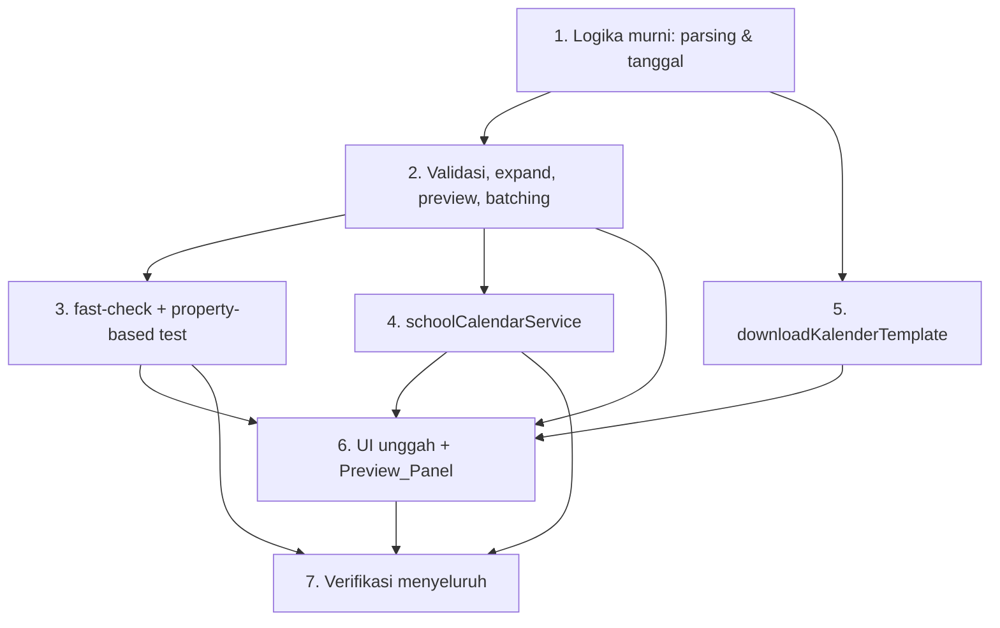

# Implementation Plan

## Overview

Rencana implementasi fitur **Kalender Pendidikan Upload**: unggah massal hari libur ke halaman admin Kalender Sekolah pada aplikasi ASIK. Task disusun inkremental dan test-driven mengikuti arsitektur existing (Pages → Services → utils murni). Logika murni dibangun lebih dulu beserta property-based test, lalu service DB, generator template, dan terakhir integrasi UI + verifikasi menyeluruh. Tidak ada task deploy/push (deploy menunggu aba-aba user terpisah).

## Task Dependency Graph



```json
{
  "waves": [
    { "wave": 1, "tasks": ["1"] },
    { "wave": 2, "tasks": ["2", "5"] },
    { "wave": 3, "tasks": ["3", "4"] },
    { "wave": 4, "tasks": ["6"] },
    { "wave": 5, "tasks": ["7"] }
  ]
}
```

## Tasks

- [x] 1. Siapkan logika murni inti parsing & tanggal (`calendarUploadRules.js`)
  - Buat file `src/features/admin/utils/calendarUploadRules.js`.
  - Definisikan konstanta `MAX_RANGE_SPAN = 400`, `BATCH_SIZE = 500`, `REQUIRED_COLUMNS = ['tanggal_mulai', 'tanggal_selesai']`.
  - Implementasi `parseFlexibleDate(rawValue)` → `{ iso, error }`: dukung `YYYY-MM-DD` dan `DD/MM/YYYY`, hasilkan ISO_Date, validasi tanggal nyata (tolak `31/02`), pakai anchor tengah hari WIB tanpa geser hari, `try/catch` fallback zona sistem.
  - Implementasi helper internal `formatIsoWIB(date)` (Intl `en-CA` `Asia/Jakarta`) + fallback.
  - Implementasi `enumerateDatesInclusiveWIB(startIso, endIso)` → `string[]` inklusif, anchor tengah hari WIB.
  - Implementasi `isWeekendWIBDate(iso)` selaras `schoolDayRules.isBusinessWeekdayWIBDate` (ISO day 6/7 = weekend).
  - _Requirements: 4.2, 5.6, 5.7_

- [x] 2. Implementasi validasi, expand, preview, dan batching (`calendarUploadRules.js`)
  - Implementasi `validateRangeRows(rawRows)` → `{ rows, errors }`: cek kolom wajib hilang, tanggal invalid, `selesai < mulai`, span > `MAX_RANGE_SPAN`, `keterangan` kosong→`null`, sertakan nomor baris (header = baris 1) di pesan galat, dan "semua-atau-tidak".
  - Implementasi `expandRangesToDailyRecords(rows)` → `{ records, usedSystemTZFallback }`: expand inklusif, `is_libur = true`, lewati weekend, dedup by tanggal dengan aturan "keterangan terakhir menang", keluaran terurut.
  - Implementasi `buildPreviewModel(dailyRecords, existingDatesSet)` → `PreviewModel`: klasifikasi `new`/`overwrite`, hitung `totalCount`/`newCount`/`overwriteCount`, set `minDate`/`maxDate`.
  - Implementasi `chunkDailyRecords(dailyRecords, size = BATCH_SIZE)` → array batch (≤ size, gabungan = input).
  - Implementasi helper murni pembentuk payload upsert (`tanggal`, `is_libur:true`, `keterangan`, `updated_at`) untuk dipakai service & test.
  - _Requirements: 4.1, 4.3, 4.4, 4.5, 4.6, 4.7, 5.1, 5.2, 5.3, 5.4, 5.5, 6.1, 6.3, 6.4, 7.2, 7.3, 7.7, 8.3, 9.1_

- [x] 3. Tambah fast-check dan property-based test untuk logika murni
  - Tambahkan `fast-check` ke `devDependencies` (`npm install -D fast-check` — konfirmasi ke user sebelum install).
  - Buat `src/features/admin/utils/calendarUploadRules.test.mjs` dengan 9 property-based test (`fc.assert`, `numRuns: 100`) sesuai section Correctness Properties di design; beri tag komentar `// Feature: kalender-pendidikan-upload, Property {n}`.
  - Siapkan generator: tanggal valid (termasuk batas bulan/tahun), string tanggal cacat, Range_Row valid di sekitar batas 400 (399/400/401), rentang beririsan keterangan berbeda, Daily_Record + subset existing, daftar & ukuran batch bervariasi (termasuk `mulai==selesai` dan size > panjang).
  - Daftarkan `src/features/admin/utils/calendarUploadRules.test.mjs` ke script `test:unit` di `package.json`.
  - Jalankan `npm run test:unit` sampai seluruh properti lulus.
  - _Requirements: 4.1, 4.2, 4.3, 4.4, 4.5, 4.6, 4.7, 5.1, 5.2, 5.4, 5.5, 5.6, 6.1, 6.3, 6.4, 7.2, 7.3, 7.7, 8.3, 9.1_

- [x] 4. Buat service akses database kalender (`schoolCalendarService.js`)
  - Buat `src/services/schoolCalendarService.js` mengikuti pola service existing (`import { supabase } from './supabase/client.js'`, parameter `supabaseClient = supabase`).
  - Implementasi `fetchExistingCalendarDates({ minDate, maxDate, supabaseClient })` → `Set<string>`: satu query rentang `gte(minDate)`/`lte(maxDate)` pada kolom `tanggal`; kembalikan `Set` ISO_Date; kembalikan `Set` kosong bila min/max null.
  - Implementasi `batchUpsertSchoolCalendar({ dailyRecords, batchSize, supabaseClient })` → `{ writtenCount }`: chunk via `chunkDailyRecords`, payload identik skema Manual_Entry, `upsert(payload, { onConflict: 'tanggal' })` per batch, guard skema payload, lempar error Bahasa Indonesia bila batch gagal.
  - _Requirements: 6.3, 7.1, 7.2, 7.3, 7.5, 8.3, 8.6, 9.1, 9.2_

- [x] 5. Tambah generator template Excel (`excelService.js`)
  - Tambah `downloadKalenderTemplate()` di `src/services/shared/excelService.js` yang me-reuse `exportJsonToExcel` dengan baris contoh (`tanggal_mulai`, `tanggal_selesai`, `keterangan`) dan nama file mengandung `template` & `kalender` (mis. `template-kalender-pendidikan.xlsx`).
  - Pastikan header menghasilkan kunci ternormalisasi `tanggal_mulai`/`tanggal_selesai`/`keterangan`; lempar error agar UI bisa menampilkan pesan Bahasa Indonesia bila unduhan gagal.
  - Jangan mengubah fungsi export existing.
  - _Requirements: 2.1, 2.2, 2.3, 2.4, 2.5_

- [x] 6. Integrasikan UI unggah & Preview_Panel di halaman Kalender Sekolah
  - Perluas `src/features/admin/pages/AdminSchoolCalendarPage.jsx`: tambah `Card` "Unggah Kalender Pendidikan" (tombol Unduh Template, input file `.xlsx`/`.csv`, indikator proses) tanpa menghapus form manual, tabel, `handleCreate`/`handleDelete`/`fetchRows`.
  - Tambah state `uploadBusy`, `preview`, `confirming`.
  - Implementasi `handleDownloadTemplate()`, `handleFileSelected(file)` (validasi ekstensi → `readExcelFileToJson` → cek kosong → `validateRangeRows` → tampilkan daftar galat bila ada → `expandRangesToDailyRecords` → hitung min/max → `fetchExistingCalendarDates` → `buildPreviewModel` → set `preview`; tampilkan peringatan bila `usedSystemTZFallback`).
  - Implementasi Preview_Panel (section/modal): total, badge "Baru"/"Timpa", daftar tanggal + keterangan + badge status, tombol **Konfirmasi Simpan** & **Batal**.
  - Implementasi `handleConfirmSave()` (`batchUpsertSchoolCalendar` → sukses: Swal jumlah + `fetchRows` + tutup panel; gagal: Swal error + PERTAHANKAN `preview`) dan `handleCancelPreview()`.
  - Pakai komponen `shared/ui` (`Button`, `Card`, `PageLayout`) + `Swal`; nonaktifkan tombol saat proses; jaga Manual_Entry tetap aktif selama batch berjalan.
  - _Requirements: 1.1, 1.2, 2.1, 3.1, 3.2, 3.3, 3.4, 3.5, 4.7, 5.7, 6.1, 6.2, 6.4, 6.5, 6.6, 6.7, 7.4, 7.5, 7.6, 8.1, 8.2, 8.4, 8.5_

- [~] 7. Verifikasi menyeluruh
  - Jalankan `npm run test:unit` (pastikan seluruh property test lulus).
  - Jalankan `npm run test` (lint + build) sampai lulus tanpa error.
  - Perbaiki masalah lint/build yang muncul akibat perubahan.
  - Uji manual di dev server: unduh template, unggah berkas valid & invalid, preview (badge Baru/Timpa), konfirmasi & batal, koeksistensi dengan input manual, dan verifikasi hari libur baru dihormati modul absensi.
  - _Requirements: 1.3, 1.4, 3.2, 4.7, 7.1, 7.4, 8.4, 9.2, 9.3_

## Notes

- **Gerbang verifikasi proyek:** `npm run test` (lint + build) dan `npm run test:unit` harus lulus sebelum fitur dianggap selesai.
- **Dependency baru:** menambah `fast-check` sebagai devDependency (Task 3). Konfirmasi ke user sebelum menjalankan `npm install -D fast-check`.
- **Tanpa migrasi DB:** tabel `school_calendar` existing sudah memenuhi kebutuhan; skema & kunci konflik `tanggal` tidak diubah.
- **Deploy terpisah:** tidak ada task push/deploy. Deploy ke produksi menunggu aba-aba eksplisit dari user.
- **Non-gangguan:** penulisan hanya `is_libur = true` dengan skema identik input manual, sehingga modul apel/mapel/pembiasaan tidak terpengaruh.
